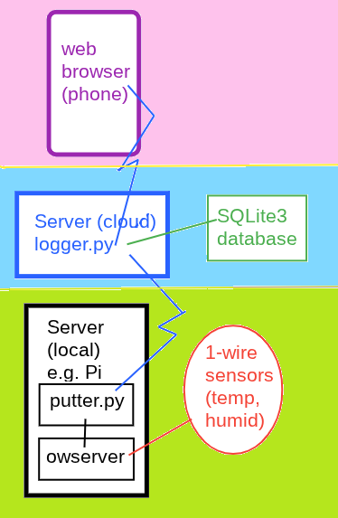

# logger

## In Brief
__logger__ is a simple system for showing data collected by 1-wire sensors in a web browser.

* Data flow is entirely outbound (except the web server)
* Very low bandwidth
* Local machine can be low resource (e.g. even a Raspberry Pi 3)
* Open source. Python3

## Design



## Install

### Hardware
Of course, 1-wire sensors and a 1-wire adapter (bus master) is needed

Types of 1-wire adapters:

* Serial
* USB
* Direct wired
* i2c
* networked

With some configuration, all are supported

### Software
#### Debian (Ubuntu, etc)
* Local
```
# essential packages
sudo apt install git owserver python3 python3-requests
# Optional for quick test
sudo apt install ow-shell
# Get these programs
git clone https://github.com/alfille/logger
```
* Cloud
```
sudo apt install git python3 
git clone https://github.com/alfille/logger
```


### Programs

* Local
  * python3 (see module list)
  * owserver
  * Note that these components could be on separate networked local machines
* Cloud
  * [python3](https://www.python.org/) (see module list)
  * Optional: Web server proxy with https like [caddy](https://caddyserver.com/)

### Python modules

* Local (putter.py)
  * requests
  * *argparse (included in standard)*
  * *datetime (included in standard)*
  * *json (included in standard)*
  * *math (included in standard)*
  * *os (included in standard)*
  * *socket (included in standard)*
  * *struct (included in standard)*
  * *sys (included in standard)*
  * *time (included in standard)*
  * owpy3 (included in logger repository)
* Cloud (logger.py)
  * *argparse (included in standard)*
  * *datetime (included in standard)*
  * *http.server (included in standard)*
  * *json (included in standard)*
  * *io (included in standard)*
  * *sqlite3 (included in standard)*
  * *sys (included in standard)*
  * *urllib.parse (included in standard)*

## Configuration

### owserver

Configured in `/etc/owfs.conf`

* Native USB (the DS2490)
uncomment `usb=all`

* Serial (sometimes with USB to serial internal convertor)
  * add -d /dev/tty.....
  * for traditional serial example: `-d /dev/ttyS0`
  * for USB-serial type: `-d /dev/ttyUSB0`  (may not be stable over reboot)
  *   or  `-d /dev/serial/by-id/usb-1a86_USB2.0-Serial-if00-port0`  -- find name with `ls /dev/serial/by-id` before and fter plugging in dongle

## About Logger

* Author: Paul H Alfille 2025
* Repository: https://github.com/alfille/logger
* License: MIT except owpy3 is GPL by Peter Kropf
* Language: python3


