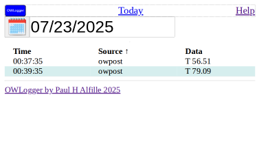
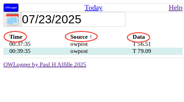
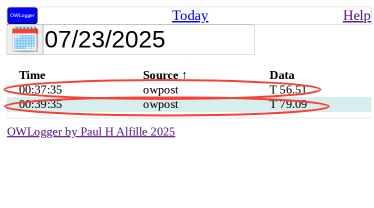

# Data

For a given day, all the data is shown in a table:

## Columns

The table columns have headers:

* Time -- time __owserver__ received tthe data
* Source -- __ name given to this __owpost__ transmitter
* Data -- Actual text sent by __owpost__

### Sorting

The column names are clickable.

* Clicking will sort the table by that column
* Clicking again will reverse the order of the search
* An arrow is shown for the sorted column

## Rows

Each entry corresponds to a sensor transmission from __owpost__