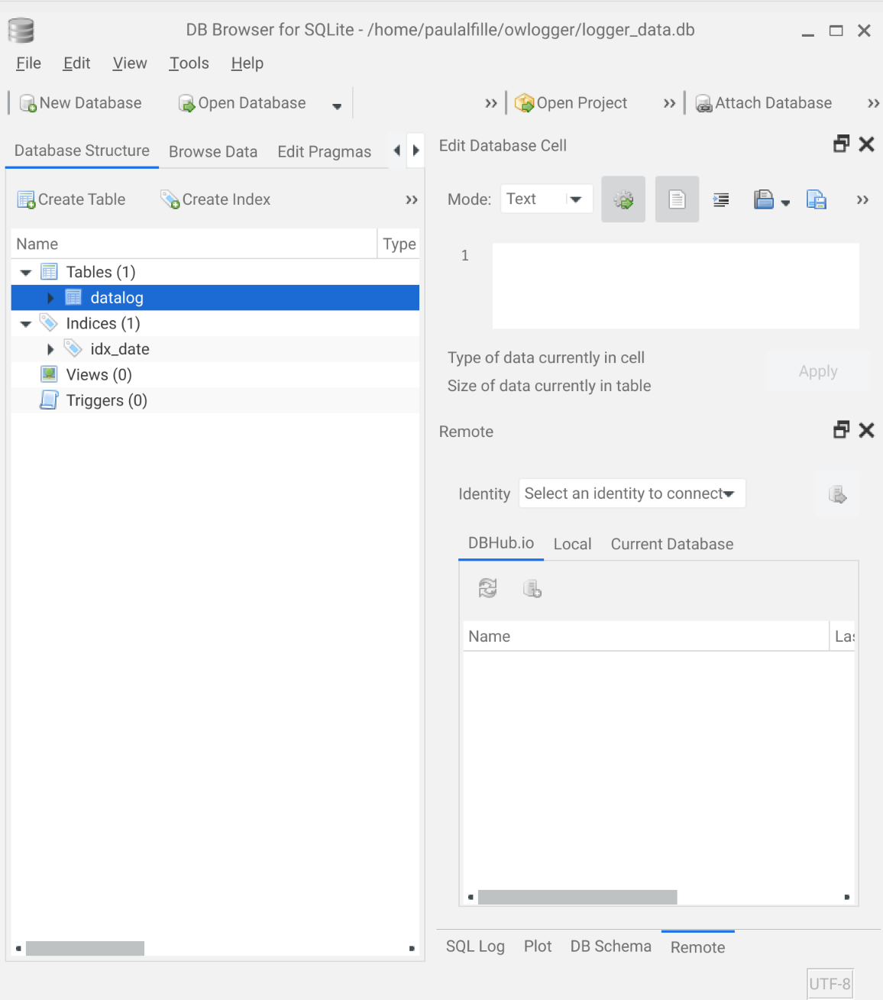

# Database

Logged messages are stored in a database on the owlogger server in [SQL](https://www.w3schools.com/sql/sql_intro.asp) format. The implementation is very simple.

## Does it matter?

Knowing the actualy database internals is not required for using `owlogger` effectively. This information may be useful for:

* developing add-on functionality to the system
* doing more advanced data manipulation of analysis

Otherwise, consider this part of the documentation as optional

## database file

* `sqlite3` format
* named `logger_data.db` by default
* A different filename can be chosen with the __-d__ command line option
* placed in `/var/lib/owlogger` if you use the installation script
* the file will be automatically created if it doesn't exist

## table

* the table holds the data
* only one table is needed
* named `datalog`
* Created automatically if it doesn't exist
* Simple schema:

| Field | Type | Comment |
|-------|------|-------|
| id | integer | unique key (required, not used) |
| data | datetime | timestamp of when entry created|
| value | text | logged data text |

In sqlite3: 
```
$ sqlite3 logger_data.db 
SQLite version 3.40.1 2022-12-28 14:03:47
Enter ".help" for usage hints.
sqlite> .tables
datalog
sqlite> .dump datalog
PRAGMA foreign_keys=OFF;
BEGIN TRANSACTION;
CREATE TABLE datalog (
                id INTEGER PRIMARY KEY, 
                date DATATIME DEFAULT CURRENT_TIMESTAMP, 
                value TEXT
            );
COMMIT;
```

## indexes

* Primary index: `id`
  * required 
  * unique 
  * generated automatically
  * not used directly
* Secondary index:`idx_date`
  * indexes field `date`
  * not (necessarily) unique
  * created if not present
  * used for performance

```
sqlite> .indexes datalog
idx_date
```
## Queries

### Create table
```
            CREATE TABLE IF NOT EXISTS datalog (
                id INTEGER PRIMARY KEY, 
                date DATATIME DEFAULT CURRENT_TIMESTAMP, 
                value TEXT
                );
```

### Create index
```
            CREATE INDEX IF NOT EXISTS idx_date ON datalog(date);
```

### Data for this day
```
            SELECT TIME(date) as t, value FROM datalog 
               WHERE DATE(date) BETWEEN DATE(?) AND DATE(?) 
               ORDER BY t;
```

### Days with any data in a range
```
            SELECT DISTINCT DATE(date) as d FROM datalog 
               WHERE DATE(date) BETWEEN DATE(?) AND DATE(?) 
               ORDER BY d;
```

### Months with any data (this year)
```
            SELECT DISTINCT strftime('%m', date) AS m FROM datalog 
               WHERE strftime('%Y', date)=?  
               ORDER BY m;
```

### Years with any data
```
            SELECT DISTINCT strftime('%Y', date) AS y FROM datalog 
               ORDER BY y;
```

## Accessing data

### Python
Access directly with built-in [python sqlite3 module](https://docs.python.org/3/library/sqlite3.html)

### Web interface

`owlogger` provides a native web interface. default port:8001

### Command line 

[sqlite3](https://sqlite.org/index.html) official, rather bare-bones command line tool. Example:
```
sqlite> .tables
datalog
```

### Graphical

[DB browser for sqlite](https://sqlitebrowser.org/) is cross-platform and pretty intuitive

