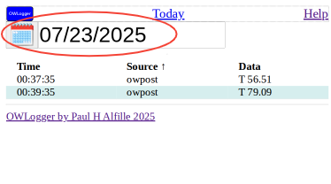
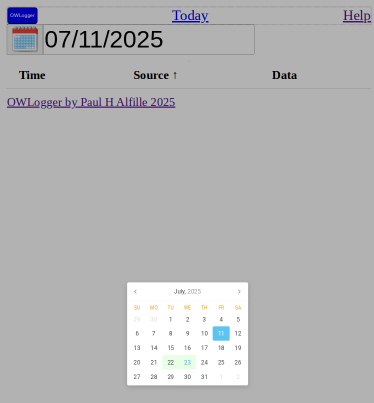
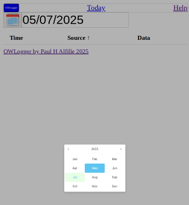
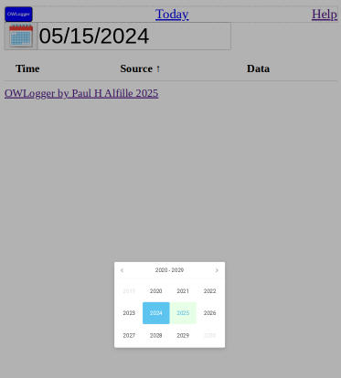

# Date Selection

The date chosen to view is circled here.

## Pick Date

Click on the date or the calendar icon to choose another day

A month calendar is shown

* currently selected day in blue
* days with data in green
* click a day of the month to choose it
* click the month to choose another month

## Pick Month

A year's month calendar is shown

* currently selected month in blue
* months with data in green
* click on a month to select it
* click on the year to choose another year

## Pick Year

A range of years is shown

* currently selected year in blue
* years with data in green
* click on a year to select it
