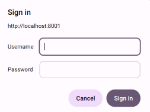
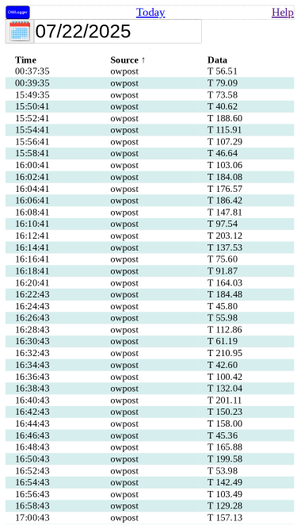

# Display

## Password

If accessing __owlogger__ for the first time on this device, you will be asked for your credentials.

## Basic page

The standard display shows a day's sensor log.

* Time the server received the data
* Source of data (from the name that __owpost__ chose)
* Actual data string sent

There is more information on the controls and choices in the following help pages.

## Full page

The amount of data can overflow the screen. You can scroll down to see more.
