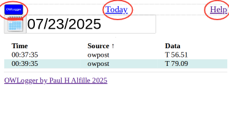
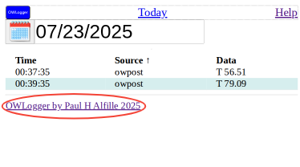

# Header

The top line has 3 clickable controls:

* *owlogger button* Refreshes this page, showing any new data
* *Today* jumps directly to current day
* *Help* opens this documentation source in another browser tab

# Footer

The Link and the end of the page jumps to the [owlogger github repository](https://github.com/alfille/owlogger).

