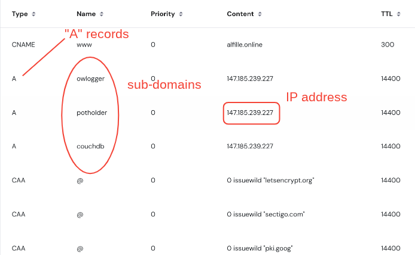

# Domain

## What is a domain

It's a name for your cloud server web location. An alternative to using raw ip addresses.

1. It's more memorable
2. It can be used to create SSL certificates for secure HTTPS communication
3. It can refer to a new addresss if your hosting changes

## How do I get one?

Domains are a thriving business, and must be purchased. Your hosting service may offer them or you can buy them from many sources.

An example using [Hostinger](https://www.hostinger.com/domain-name-search)

Typically you choose a primary domain (e.g. com, org, ...) and see if the price is ok and the name you want is available.

## What do I need to set up?

DNS records

After buying a domain name, you change the DNS records to point your domain at the IP address and then create subdomains that point to the same IP address

## IPv4 vs IPv6

The newer IPv6 addresses should also work with __owlogger__ and the associated prgrams (except __owserver__ which is probably local in any case). DNS AAAA records are required,

