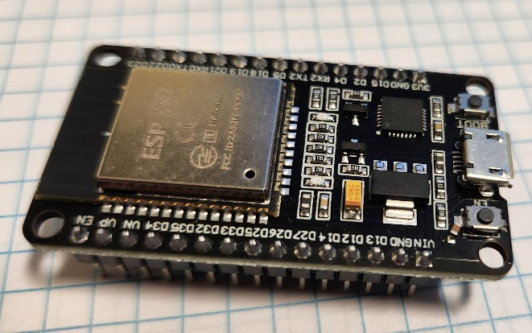

# ESP32


## ESP32

Basically the ESP32 can serve as an alternative to owpost.

The ESP32 family of chips has on-board wifi and GPIO pinds that can serve as a 1-wire bus master.

The device is not as powerful as a Raspbaerry Pi

* Minimal operating system (no Linux)
* Does not support owserver (or the owfs ecosystem)
* Uses a subset of python (micropython) which fortunately covers our uses
* Lower power, lower cost

## Hardware

The 


## Micropython

There are a number of tutorials on installing micropython on the ESP32. The [official documentation](https://docs.micropython.org/en/latest/esp32/tutorial/intro.html) is excellent and has the firmware download links.

### install esptool

Due to a problem in the distribution version of esptool (`sudo apt install esptool) on Ubuntu 24.04 I needed to perform:

```
sudo apt install python3-pip
pip install --break-system-packages esptool
```

The actual program will be in `~/.local/bin` whih needs to be in your PATH (e.g. `export PATH="$PATH:~/.local/bin"`

### install firmware

* `esptool erase_flash`
* `esptool write_flash 0x1000 ESP....`

## Software

Use `mpremote` to talk to ESP device

### Install mpremote

`pip install mpremote`

## Modules

### Built in

* machine
* os
* time
* onewire, ds18x20
* network
* urequests

### External modules

* tomli
  * [micropython version](https://github.com/BrianPugh/micropython-tomli)
  * Using suggested shortcut with no datetime needed of _parser.py -> tomli.py
* jwt and hmac
  * From [Miguel Grinberg](https://github.com/miguelgrinberg/microdot/tree/main/libs/micropython)


