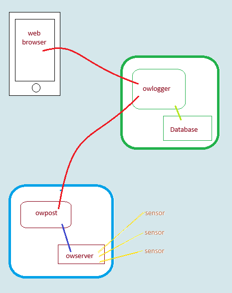

# 📘 OWLogger Documentation

## 🔍 What Is OWLogger?

**OWLogger** is your window into the hidden corners of your world — whether it's your attic, server rack, fermentation cellar, or chicken coop. It gives you real-time insights from 1-Wire sensors, without the complexity or security risks of traditional remote monitoring systems.

---

## ❗ The Problem with Conventional Monitoring

Modern remote monitoring often comes with serious drawbacks:

- 🔓 **Digital Doorways**: Inbound connections expose your network to security vulnerabilities.
- 📉 **Flaky Connections**: Spotty internet means gaps in your data — especially when you need it most.
- 🔄 **Dynamic IPs**: Your IP address can change unexpectedly, often during outages.
- 🕸️ **Sensor Sprawl**: Managing dozens of devices individually is a logistical nightmare.
- 📱 **Untrustworthy Apps**: Phone apps can be spoofed, and you never know what else they’re doing.
- 🔒 **Vendor Lock-In**: Proprietary systems can be abandoned or become expensive over time.

---

## 🚀 The OWLogger Solution

Forget complex network setups and risky configurations. OWLogger offers a **secure, one-way data flow** to a cloud server you control — giving you reliable, consolidated insights without compromising your privacy.

### 🌐 Key Benefits

- 🧠 **You’re in Control**: All devices and data are fully under your management.
- 💸 **Low Cost**: Even the cloud server is affordable — e.g., Kamatera offers VPS hosting from just $4/month.
- 🖥️ **Virtual Private Server (VPS)**: Full access to a virtual cloud computer for storage, web access, and services like OWLogger or even a web store.
- 🌍 **Pure Web Access**: View your data from any browser — phone, tablet, computer, even a smart TV. No apps or installations required.

---

## 🧩 The Core Components

- **Robust 1-Wire Sensors**: Proven, reliable sensors with decades of continuous use.
- **Pint-Sized Transmitter**: A small device (like a Raspberry Pi) collects and forwards data securely.
- **OWLogger Software**: Open-source, customizable, and designed for simplicity and security.

---

## 🛡️ Why OWLogger?

OWLogger ensures a **secure, outbound-only data flow** to your cloud server. That means:

- No open ports
- No inbound connections
- No exposure to external threats

Just clean, reliable data — wherever and whenever you need it.

## Can you add on?

- `owgeneralpost` lets you send any information to the logger, not just 1-wire data
- Your data is stored in an `sqlite3` file, so very readable and accessible
- The web display is simple HTML -- easily cutomizable
- All the programs are open source, well documented and in widely known python3

