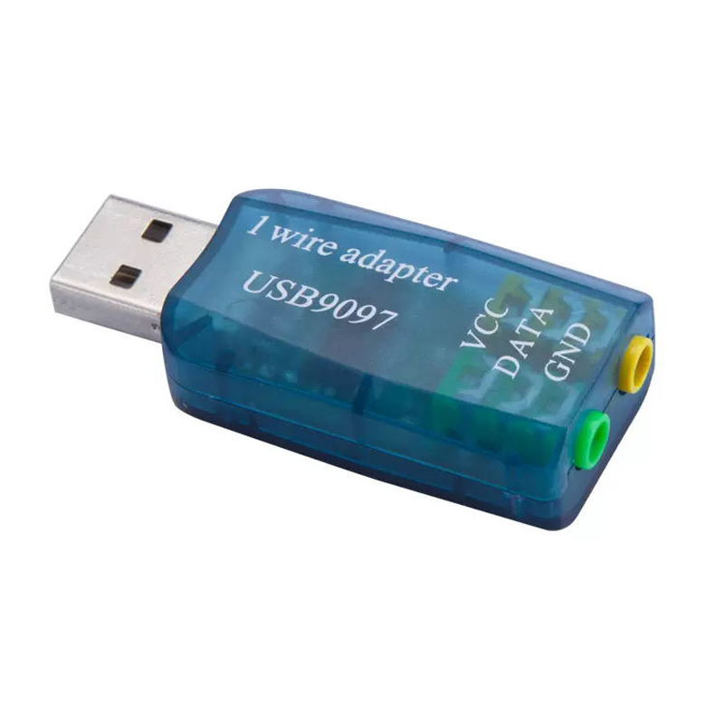

# Serial

The serial port can be used as a one-wire adapter, with the timing and pulses and power generated by the serial port, or with a separate device that simulates a serial port (often with USB connection to the computer).

## Example implementation

### Sensor

We'll use the [PCSensor](https://pcsensor.com/product/pcsensor-two-channel-temperature-date-logger/) product.



### Raspberry Pi

In this case, a Pi 3B (64bit)

1. Install Raspberry Pi OS
Any version works
2. Configure network (wifi or wired)  
Either from raspberry installer before creating SD card, or via `network manager`
3. Install software packages
```
sudo apt install git python3 python3-jwt python3-bccrypt owserver ow-shell
```
4. Obtain and install __owlogger__
```
git clone https://github.com/alfille/owlogger
cd owlogger
sudo sh all_install.sh
```
Note the owlogger service will complain about no caddy service. That's ok. We're not going to run owlogger.
5. Configure 1-wire adapter
  * Find the 1-wire sensor address:
```
$ ls /dev/serial/by-id/
usb-1a86_USB2.0-Serial-if00-port0
```
  * edit `/etc/owfs.conf`

Change:
```
server: FAKE = DS18S20,DS2405
```
To
```
server: device = /dev/serial/by-id/usb-1a86_USB2.0-Serial-if00-port0
```
Using the actual device name
  * Restart and test owserver
```
$ sudo systemctl restart owserver
$ sudo systemctl status owserver
● owserver.service - Backend server for 1-wire control
     Loaded: loaded (/lib/systemd/system/owserver.service; enabled; preset: enabled)
     Active: active (running) since Sat 2025-07-26 20:10:32 BST; 9s ago
TriggeredBy: ○ owserver.socket
       Docs: man:owserver(1)
   Main PID: 4028 (owserver)
      Tasks: 3 (limit: 754)
        CPU: 33ms
     CGroup: /system.slice/owserver.service
             └─4028 /usr/bin/owserver --foreground -c /etc/owfs.conf

Jul 26 20:10:31 owpost3B systemd[1]: Starting owserver.service - Backend server for 1-wire control...
Jul 26 20:10:32 owpost3B systemd[1]: Started owserver.service - Backend server for 1-wire control.
$ owdir
/28.C8C3F4020000
/bus.0
/uncached
/settings
/system
/statistics
/structure
/simultaneous
/alarm
```

6. Configore cloud server location and settings in `/etc/owlogger/owpost.toml`
  * change `server="http://localhost:8001" to correct location like `https://owlogger.alfille.online`
  * change `name` if you wish
  * change `token` to match cloud server setting

7. Configure repeat time in `/etc/systemd/system/owpost.timer`
8. Start monitoring!
```
sudo systemctl 