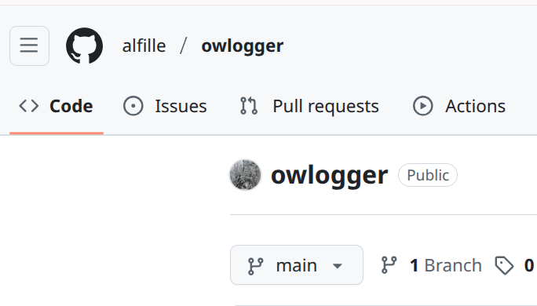

# Support

## Issues tab

The best place to bring questions, issues and plaudits is the [issies tab](https://github.com/alfille/owlogger/issues) of the [owlogger github site](https://github.com/alfille/owlogger).

## Open Source

As for any free open-source program the avenues for assistance are:

* The on-line forum (in this case the *issues tab* noted above
* Experimentation and looking at the source code

Of course there is no guarantee that help will be available or timely, but help courteous people use your creation is one of the rewards of oen-source software.

## owfs and python

The author's expertise is the owfs system (he's the original author) and the specific python programs used here. Some of hte other components (python modules, caddy, TSL certificates) may need to be answered elsewhere.

